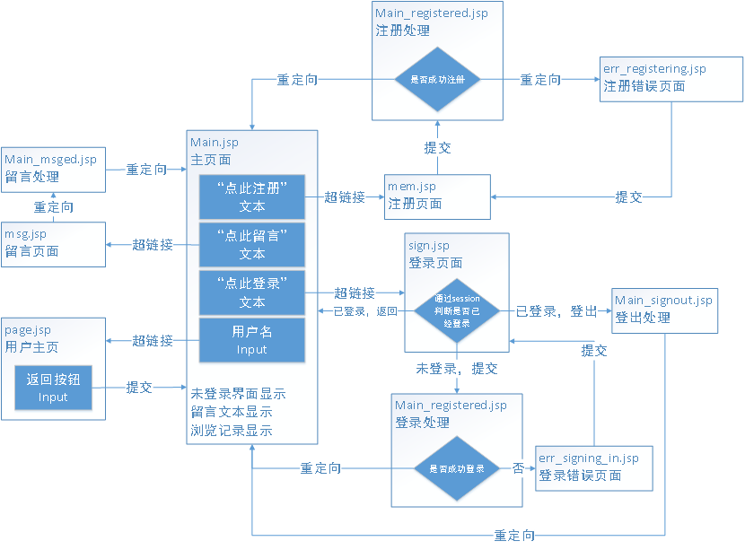

# GrapeHP
小葡主页|JSP网页
## 1.流程 
**页面** main reg sign根据登录状态显示不同的页面 
**处理** Main_Registered Main_signed_in 重定向至主页 
登录状态记录在session中 
Cookie则用于记录当前的部分用户信息，用于自动填充 

## 2.留言板的解析与打包
留言存在application中，名字为“message”的一个vector中
vector中的每一个字符string都是一条留言，组成结构是：
*字体格式#字体大小#用户名#留言内容#留言内容#留言内容...*
使用2层for循环进行解析操作；